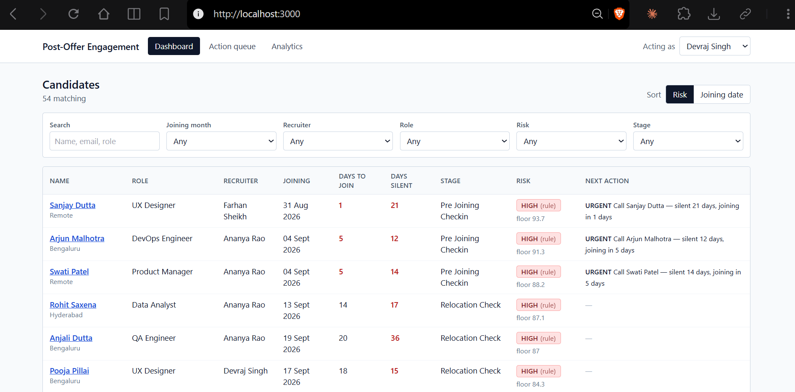
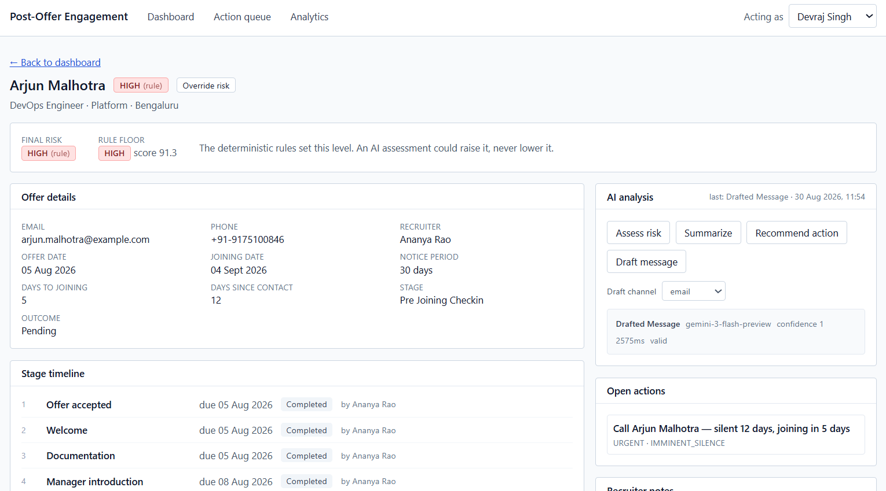
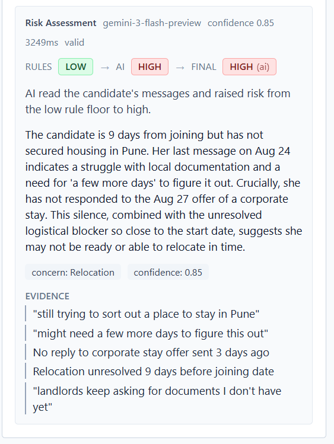
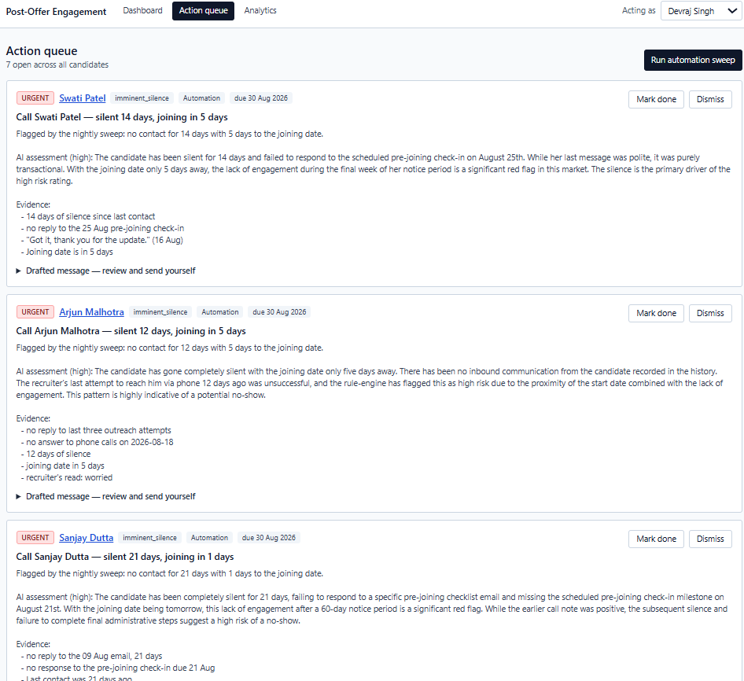
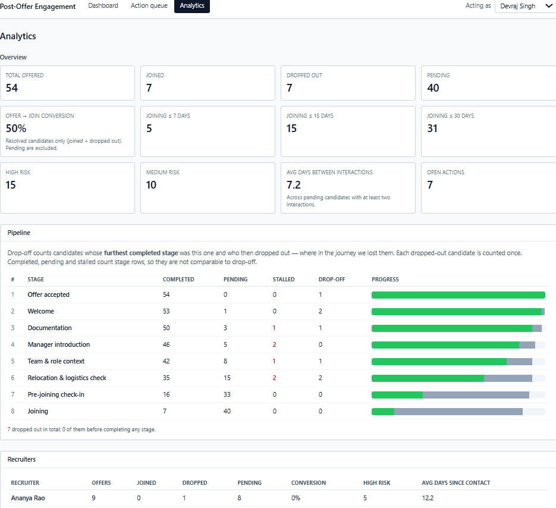

# Post-Offer Engagement Platform

A triage system for the gap between offer acceptance and joining date.

## The problem

A candidate accepts an offer, then serves 30–90 days of notice before they
actually start. In that window nothing binds them to the company, and a
meaningful share never show up on day one. The recruiter usually can't see it
coming, because the candidate went quiet and quiet looks the same as fine.

This system turns 40 pending joiners into a ranked list of the five worth a
phone call this morning, with the reasoning attached.

**The AI never contacts the candidate.** It decides who needs attention,
explains why using the candidate's own words as evidence, and drafts a message
the recruiter edits and sends. That constraint is deliberate: a wavering
candidate who receives an obviously automated "excited to have you aboard!"
leaves faster, not slower. The signal that matters is that a real person
noticed.

## Setup

```bash
git clone <repo>
cd post-offer-engagement
docker compose up
```

Three services come up: Postgres, the FastAPI backend on `:8000`, and the
Next.js frontend on `:3000`. The database seeds itself with 54 candidates on
first boot. API docs at `http://localhost:8000/docs`.

It runs without an API key — every AI call degrades to a deterministic
fallback. To enable the AI layer, copy `.env.example` to `.env` and set:

```
GEMINI_API_KEY=<key from aistudio.google.com>
GEMINI_MODEL=gemini-3-flash-preview
```

Tests:

```bash
docker compose exec api python -m pytest
```

263 tests. Run them inside the container — the pinned Postgres driver has no
wheel for newer local Python versions, and the suite is date-sensitive, so a
host in a different timezone from the container will fail boundary tests.

## Screenshots

Candidate dashboard, sorted by risk — the recruiter's morning view.



Candidate detail: offer information, stage timeline, conversation history, and
the AI panel. The rule floor is shown alongside the final risk so
`max(rule, ai)` is legible at a glance.



The brief's worked example — a candidate still figuring out relocation — is
seeded as Ritika Bansal. The deterministic rules score her LOW because she
replied three days ago and nothing is overdue. The AI raises her to HIGH on the
content of that reply, quotes her own words back as evidence, and additionally
flags that she never answered the corporate-stay offer sent three days ago —
silence inside an active conversation, which no timestamp rule can see.



The follow-up queue, generated by the nightly automation sweep. Each action
carries the AI's reasoning, its evidence, and a drafted message the recruiter
reviews and sends themselves.



Analytics: conversion, upcoming joiners, the stage funnel with drop-off
attribution, and recruiter-wise performance.



## Architecture

FastAPI + SQLAlchemy 2 + PostgreSQL 16 on the backend, Next.js App Router on
the frontend, Gemini Flash behind a provider interface for the AI layer.

Routers contain no business logic — they validate input, call a service, and
return a response. Services own the transactions.

The frontend splits deliberately: the candidate dashboard and all AI mutations
are client components using TanStack Query (five simultaneous filters need
cached filter state and `keepPreviousData` so the list doesn't flash empty on
every change), while the candidate detail and analytics pages are Server
Components with plain fetch, because they load once and don't need
interactivity.

### Schema

Eight tables, each answering a different question the product asks:

| Table | Question it answers |
|---|---|
| `candidates` | Who has an offer and hasn't joined? |
| `recruiters` | Who owns them? |
| `journey_stages` | What does the process look like? (template) |
| `candidate_stages` | Where is this person, and what's overdue? |
| `interactions` | When did we last talk, and what was said? |
| `ai_analyses` | What did the model say, and did it work? |
| `follow_up_actions` | What needs doing today? |
| `audit_log` | Who changed what? |

`journey_stages` is a seeded table rather than a code enum, so the engagement
workflow is data. Adding a touchpoint is a row, not a deploy.

### Stage scheduling: hybrid anchoring

The early stages are driven by the offer date — documentation and background
verification start immediately and take as long as they take, regardless of
when the person joins. The late stages are driven by the joining date — a
pre-joining check-in only means anything relative to day one.

So each stage carries an `anchor` (`offer` or `joining`) and an `offset_days`:

| Stage | Anchor | Offset |
|---|---|---|
| Offer accepted | offer | 0 |
| Welcome | offer | +1 |
| Documentation | offer | +3 |
| Manager introduction | offer | +21 |
| Team & role context | offer | +35 |
| Relocation & logistics check | joining | −25 |
| Pre-joining check-in | joining | −10 |
| Joining | joining | 0 |

A single anchor breaks on real notice periods. Fixed-from-offer schedules a
pre-joining check-in for day 60 on someone who joins on day 30.
Backwards-from-joining schedules document collection to begin in month two for
a 90-day notice, which is absurd — verification has to run early.

On short notice periods the two anchors collide: at 30 days,
`team_context` (offer+35) lands after `relocation_check` (joining−25). The
scheduler detects this and compresses the offer-anchored stages proportionally
into the available window, preserving order. The 60-day notice period is the
exact crossover point where `offer+35 == joining−25`. The function is pure —
no database, no `datetime.now()` — and is tested across 15/30/60/90/120-day
notice periods with an assertion that due dates never run backwards.

## The engagement journey

The brief's sample journey has six stages. This implementation has eight.

The two additions — **Team & role context** (offer+35) and **Relocation &
logistics check** (joining−25) — close a five-week hole between the manager
introduction and the pre-joining check-in. That hole is the dangerous part.
Contact clusters in the first three weeks (documents, verification) and the
final week (logistics), leaving the middle of the notice period unmonitored,
which is exactly when doubt incubates and when competing recruiters call,
because everyone in the industry knows who is serving notice.

Each added touchpoint is designed to do two jobs: deliver something the
candidate didn't have, and require a substantive reply. The second half
matters as much as the first. A touchpoint that demands a real answer is a
measurement instrument — non-response is data, a slow response is data, and a
three-word answer where they used to write paragraphs is data.

Note also that **Manager introduction** is the highest-leverage stage in the
journey. The single best predictor of showing up is having spoken to the
human you'll actually report to. It converts an abstract company into a
specific relationship, and it's hard to ghost a person.

## Risk classification

Two layers. Deterministic rules set a floor; the AI may raise it; a human
overrides both.

```
final = max(rule_floor, ai_assessment)
```

### The rule floor

Computed from days-to-joining, days-since-contact, maximum stage overdue days,
and the recruiter's own structured read from call notes.

- **HIGH** — silent ≥10 days; or silent ≥5 days with joining within 14 days;
  or a stage >7 days overdue with joining within 21 days; or a `counter_offer`
  or `notice_period` blocker logged on a call
- **MEDIUM** — silent ≥7 days; or joining within 7 days regardless of contact;
  or any stage overdue; or any other logged blocker; or a `worried` recruiter read
- **LOW** — otherwise

Silence is weighted by imminence. Twenty days of quiet at day 80 is normal;
five days of quiet at day 3 is an emergency.

`risk_score_base` (0–100) ranks candidates *within* a band; the band itself is
decided by the rules. Raw severity is silence (0–45) + imminence (0–35) +
stage lag (0–20), then mapped proportionally into the band's window (LOW 0–39,
MEDIUM 40–69, HIGH 70–100). The first implementation clamped rather than
scaled, which collapsed every mildly-high candidate onto exactly 70.0 and
destroyed the ranking — which would have quietly broken the product's only
real output.

Blocker signals are an additive modifier on top, capped at 100, and only count
from interactions in the last 30 days. Because the band is decided before the
score is mapped into it, blocker points structurally cannot push a candidate
across a band boundary — only the explicit floor does that. That makes
"`recruiter_read=unsure` nudges within a band but never changes it" a
guarantee by construction rather than a tuning coincidence.

### What the AI adds

The rules read structure — timestamps, due dates, tagged fields. They cannot
read prose. SQL can't distinguish "relocation is sorted, flat booked" from
"still figuring out relocation"; the same word, opposite meanings.

So the AI reads the interaction text and may raise the level, citing evidence.
Concretely, on the seeded data the rules place Sana Qureshi at MEDIUM (50.1) —
she replied three days ago and nothing is overdue. Her counter-offer signal
exists only in an inbound WhatsApp message: *"my current company found out I'm
leaving and they've called me in for a chat tomorrow."* The AI raises her to
HIGH and quotes that line back as evidence.

Rules catch the candidates who go silent. The AI catches the ones who reply
promptly and are still leaving.

### Limitations — read this section

**There is no ground truth.** No candidate in this system carries a
`was_actually_going_to_drop` label, so accuracy is unmeasurable. Any accuracy
figure would be fabricated.

**Silence is ambiguous.** A candidate deep in handover at their current job
looks identical to one who has checked out.

**Candidates are strategically polite.** Almost nobody announces they are
leaving. The signal is hedging and omission, not declaration.

**The strongest predictor is invisible.** A competing offer happens in someone
else's inbox. This system cannot see it, and it is probably the single largest
cause of the outcome being predicted.

**The data is sparse and second-hand.** Post-offer threads are thin — a few
logistics exchanges. Call notes are a recruiter's hurried paraphrase, not a
transcript, so the emotional texture that made the recruiter uneasy is already
stripped out before the model sees it. The prompt weights verbatim inbound
messages above call notes for this reason, and the structured
`recruiter_read` field captures the gut read at the only moment it exists.

**It is tuned to over-flag, deliberately.** A false positive costs one
unnecessary phone call. A false negative costs a hire and three months of
pipeline. The bands are set accordingly.

**Therefore this is a prioritisation tool, not a prediction engine.** It sorts
an attention queue. Every AI-assigned level must cite evidence, and HR override
is mandatory and always wins — recorded with a required reason, because a
recruiter marking an assessment wrong is the only correction signal this
system will ever receive.

## AI flow and structured output validation

Four functions: `assess_risk`, `summarize_interactions`,
`recommend_next_action`, `draft_message`. Each follows the same path:

1. Build a prompt from real candidate context — role, days to joining, stage
   progress, recent interactions — using a versioned template (`prompt_version`
   is stored with every result).
2. Call the provider in JSON mode.
3. Parse into a Pydantic contract.
4. On `ValidationError`: **retry once**, appending the validation error to the
   prompt as a repair instruction. Mark `validation_status='repaired'`.
5. On a second failure: return a **deterministic rule-based fallback**, set
   `was_fallback=True`, and still return 200 with the flag visible to the
   caller and surfaced in the UI.
6. Persist every attempt to `ai_analyses` — model name, prompt version, raw
   response, parsed output, confidence, latency, validation status, fallback flag.

**The application never breaks because the model misbehaved.** This was
verified accidentally rather than by a mock: during a live automation sweep,
Gemini returned a 5xx on one candidate's risk assessment. The engine caught it,
fell back to the deterministic floor, and a candidate silent for 12 days with 5
days to joining was still filed at URGENT with a drafted message — labelled
honestly in the UI as a rule-based fallback, with the caveat that no message
content was read.

A provider exception skips the repair retry. The repair prompt fixes a shape
the model got wrong; a transport failure is not a shape problem, and a second
call just spends more seconds failing while a recruiter waits.

### Guardrails

Drafted messages are scrubbed of invented promises — changes to compensation,
start date, or role scope that the recruiter never offered.

**Guardrails run on outbound drafts only, never on reasoning or summaries.**
A draft is something a recruiter sends, so an invented promise in it is a
liability. Reasoning is inbound analysis: *"he's waiting on his employer's
counter-offer number"* is precisely the evidence the recruiter needs. Scrubbing
the word "compensation" out of an analysis would delete the finding and leave a
risk badge with no reason behind it.

### Observability

`ai_analyses` records every call — including failures — with latency,
validation status, and prompt version, so a prompt change can be attributed to
an outcome change.

## The automated engagement workflow

Two rules, running nightly via APScheduler and available on demand at
`POST /api/v1/automation/run`.

**`imminent_silence`** — pending candidates joining within 7 days with no
contact in 5 days (or never contacted, counting from the offer date). Runs an
AI assessment, drafts a personalised message, and files a follow-up action with
a priority derived from the risk floor.

**`stage_stall`** — a stage still pending past its due date. Files a factual
nudge naming the stalled stage. No AI call; nothing to interpret.

Both are idempotent within 24 hours per candidate and rule. The 24-hour window
is escalation rather than pure de-duplication: an open action older than a day
does not block a new one, because a candidate still silent tomorrow has a
genuinely worse problem and the first nudge went unactioned.

**Sending is simulated.** The drafted message is stored and the send is logged;
nothing is transmitted. This is consistent with the core constraint — the
system writes into the recruiter's queue, not to the candidate.

Two honest notes on this layer:

Every `imminent_silence` catch already has a HIGH rule floor by construction
(silent ≥5 days AND joining ≤7 days → HIGH). So the AI in that path can never
actually raise the risk level. Its real contribution there is the evidence and
the draft, not the risk elevation.

The nightly job runs a full risk recompute *before* the sweep. Without it,
badges go stale for exactly the candidates that matter — silence generates no
interactions, and interactions were the only other recompute trigger. Measured
on seeded data, 11 of 40 pending candidates would be scored below their true
floor within three days.

## Analytics

Three endpoints, all aggregated in SQL.

**Conversion** — the denominator is *resolved* candidates only (joined +
dropped out), not pending ones. Counting pending candidates as failures would
make the number sag every time an offer went out and recover as the cohort
resolved, moving for reasons unrelated to recruiter performance. Returns null,
never 0.0, when nothing has resolved.

**Stage drop-off** — a candidate counts against stage S if their
`final_outcome` is `dropped_out` and S is the furthest stage they completed.
Each dropped candidate is counted exactly once, against the last thing that
went right. Candidates who dropped before completing any stage are reported
separately rather than attributed to stage 1, which would overstate it.

**Average days between interactions** — computed per candidate, then averaged
across candidates, so one chatty candidate doesn't dominate. Candidates with a
single interaction are excluded rather than counted as a zero gap — counting
them would drag the average toward zero for exactly the quiet candidates this
product exists to notice.

"Joining within N days" is a single shared predicate used by the risk engine,
the automation rules, the dashboard filter and analytics, with one explicit
flag for whether overdue candidates are included. Automation includes them (a
pending candidate whose start date already passed is the most alarming row in
the table); analytics excludes them (a date two months past is not "joining in
the next 7 days"). The divergence is a decision on the record with tests
pinning both halves, rather than four WHERE clauses drifting apart.

## Testing

263 tests, run against real PostgreSQL rather than SQLite — an early bug was
masked precisely because SQLite doesn't enforce enum column types, and a second
one because `docker compose down -v` wipes volumes but does not rebuild images,
so a corrected model was being tested through a stale container.

Coverage is weighted toward the paths where failure is silent: stage-date
compression across notice periods, the AI repair-and-fallback ladder, rule-floor
band boundaries, HR override protection, and automation idempotency.

Load-bearing tests were mutation-checked rather than trusted — deliberately
breaking the behaviour to confirm the test fails. This found one test that
passed against a broken implementation: the AI degradation test exercised the
engine's internal fallback but never the automation service's own last-resort
path. Fixing that gap surfaced a real bug, where an action's priority was
derived from a risk level that the just-failed AI call was supposed to have
set — so a silent, about-to-join candidate was being filed as `medium`
precisely when the AI was unavailable. Not missed, but buried in the queue,
which is the same failure in its quietest form.

## Bonus items

- **Configurable workflows** — `journey_stages` is data, not code
- **Background jobs** — APScheduler nightly recompute + sweep, plus a manual trigger
- **Audit trail** — every candidate update, stage transition and override, with actor
- **AI guardrails** — outbound-only scrubbing, with the reasoning above
- **Observability** — `ai_analyses` records every call including failures
- **Email/WhatsApp** — simulated send; the schema is channel-agnostic and
  integration-ready, but no live provider is wired

## Trade-offs

**No Alembic.** Schema is created via `create_all()` on startup. A schema
change therefore requires `docker compose down -v`. Alembic is the correct
production answer; this was a deliberate time trade.

**No authentication.** A recruiter-switcher dropdown sets an `X-Actor` header
that feeds the audit log. Real auth is hours of work for zero graded points,
and the audit trail — which is what actually matters here — is fully present.

**Interaction logging is manual.** This is the weakest link in the system: the
risk signal is only as good as recruiter diligence, and an unlogged reply makes
a responsive candidate look silent. Screenshot OCR was considered and rejected
— it reduces typing but not the real friction, which is remembering to log at
all. The production answer is inbound ingestion via the WhatsApp Business API
and a Gmail connector.

**Free-tier LLM.** Free-tier Gemini requests may be used to improve Google's
models, which is fine for synthetic data and unacceptable for real candidate
information. Production would require the paid tier or Vertex AI.

**Some duplicated logic.** "Preferred channel" is implemented twice, the rule
floor is computed more than once per automation candidate, and one small band
mapping is mirrored in TypeScript on the frontend. Each is documented; none
would survive a refactor pass.

**15 hand-written high-risk candidates** rather than the suggested 8–10. The
seeded messages for these were written by hand, in lowercase with hedging and
typos, because LLM-generated "I am concerned about relocation" text makes
concern detection circular and trivially easy. The remaining candidates use
generic templates.

## What changes at 1 million candidates

**Partition `candidates` by `joining_date`.** Every hot query is bounded by a
joining window; partition pruning turns full scans into single-partition reads,
and resolved cohorts age out into cold partitions.

**Move AI calls to a queue.** They are the only slow, failure-prone,
rate-limited operation in the system. Workers consuming a queue with per-tenant
rate limiting, so a provider outage backs up rather than dropping work — and
the API stops blocking for 2–4 seconds per assessment.

**Batch the nightly sweep.** A single-process sweep over a million rows in one
transaction is a lock-holding, memory-growing failure. Chunk by partition, with
per-chunk commits and a resumable cursor, so a crash costs one chunk.

**Materialise analytics.** The funnel and conversion aggregates scan the whole
candidate table. They become a rollup table refreshed on a schedule, with the
live endpoints reading precomputed rows.

**Cursor pagination.** `OFFSET 50000` degrades linearly; keyset pagination on
`(joining_date, id)` does not. The default sort already has a stable
tiebreaker for this reason.

**Read replicas** for analytics and dashboard reads, keeping the primary for
writes and the sweep.

**Cache the rule floor.** It is deterministic given three inputs; at scale it
becomes a scheduled bulk UPDATE rather than a per-request computation.

## What I would improve next

- Inbound WhatsApp and email ingestion, so logging doesn't depend on recruiter memory
- Alembic migrations
- Consolidating the duplicated channel and rule-floor logic
- Reconciling the two urgency vocabularies (`NextAction.urgency` vs
  `FollowUpPriority`) and deciding whether the AI's suggested timing is
  advisory or authoritative
- Recruiter notifications on new URGENT actions
- A feedback loop: recruiters marking assessments wrong is the only label this
  system can ever generate, and it should eventually train something
